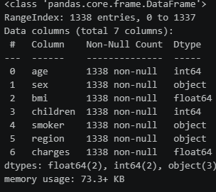
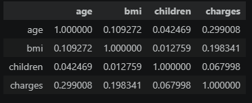
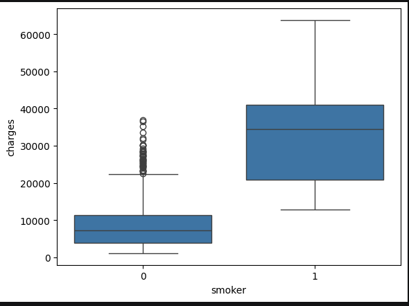
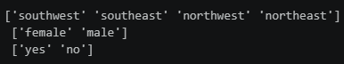
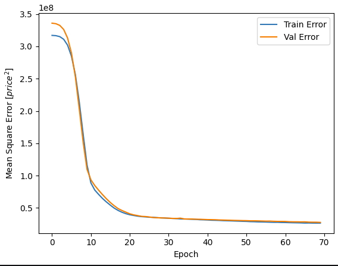
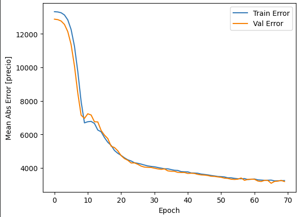
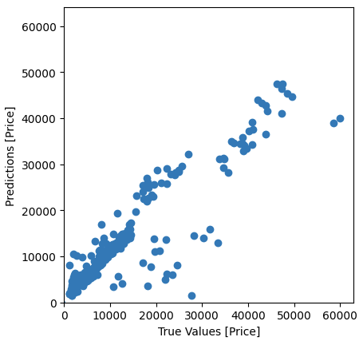

# Predicción del seguro

En este proyecto se utilizan técnicas de Deep learning con el objetivo de predecir el cargo del seguro. Estos datos se han obtenido a través de la página de Kaggle.

## Estudio de los datos (EDA)

Para empezar la limpieza se utilizará el comando .head() para ver las primeras cinco filas del dataset con el objetivo de saber las columnas y como son los datos.

 

Observamos que las columnas son Edad, sexo, BMI (índice de masa corporal), hijos, fumador, región y pago. El pago es la variable objetivo.
Utilizaremos la función .info() para conocer los valores y si tenemos valores nulos.

Se observa que no hay valores nulos en este dataset. Por lo general los datasets de Kaggle vienen bastante limpios y preparados para utilizar técnicas de inteligencia artificial.
En otros casos es necesario realizar una limpieza de los datos como puede se eliminando valores nulos (en caso de ser muy pocos, usualmente menos de 3%) o si son necesarios y es posible
sustituirlos por la mediana o la media.

Con info() se ve que los valores de Edad, BMI, hijos y pago son numéricos por lo que se realizará un estudio de su correlación.

Se aprecia que la edad y el BMI tienen una correlación débil positiva con el pago y el número de hijos la correlación es prácticamente nula, este último atributo se podría eliminar debido a su baja correlación pero
como en este dataset hay tan pocos atributos la mantendremos.

Como se ha especificado a la hora de utilizar técnicas de inteligencia artificial es conveniente estudiar los distintos atributos con respecto a la variable objetivo, como se muestra en la siguiente imagen
realizando un diagrama de cajas y bigotes de la variable objetivo con los fumadores

Pero debido a la poca cantidad de datos de este dataset los utilizaremos todos para predecir el pago.

### Tranformaciones

Las técnicas de inteligencia artificial es necesario que se les pasen datos en forma numérica, es por ello que las variables como sexo, fumador y región se pasen a numérica.
Antes de nada necesitamos saber que posibles datos hay en estas columnas, por lo que usaremos el comando unique()

Observando que el sexo solo es masculino o femenino por lo que se puede sustituir por 0 y 1 respectivamente, con fumadores es no o si por lo que también se sustituye con 0 y 1 respectivamente. 
Sin embargo con región tenemos cuatro posibilidades es por ello que realizaremos un one hot encoder, dividiendo la columna en las cuatro posibles opciones tranformando a formato binario.

## Redes neuronales

Con ello ya podemos empezar con el modelo. Primero dividiremos los datos en un 80% de entrenamiento y un 20% de prueba y escalaremos los datos para evitar el sobreajuste. Creamos el modelo como se muestra
en el código y realizaremos un entrenamiento con 60 épocas.

Tras el entrenamiento comprobaremos como ha evolucionado las pérdidas mirando el error cometido con MSE(error cuadrático medio) y el MAE(Error absoluto medio).

Por lo general el durante el entrenamiento con la prueba han ido parejos lo que muestra que no ha sufrido de sobreajuste. Por lo que ya podemos implementar y comprobar como funciona nuestro modelo

Observando la gráfica de los valores predichos con los reales esta bastante bien aunque contiene pequeños errores. Para comprobar su rendimiento de forma numérica utilizaremos las siguientes métricas

