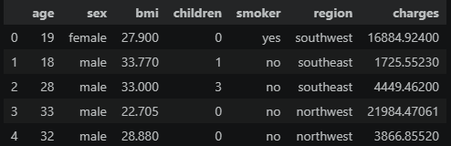

# Predicción del seguro

En este proyecto se utilizan técnicas de Deep learning con el objetivo de predecir el cargo del seguro. Estos datos se han obtenido a través de la página de Kaeggle.

## Limpieza de datos

Para empezar la limpieza se utilizará el comando .head() para ver las primeras cinco filas del dataset con el objetivo de saber las columnas y como son los datos.

 

Observamos que las columnas son Edad, sexo, BMI (índice de masa corporal), hijos, fumador, región y pago. El pago es la variable objetivo.
